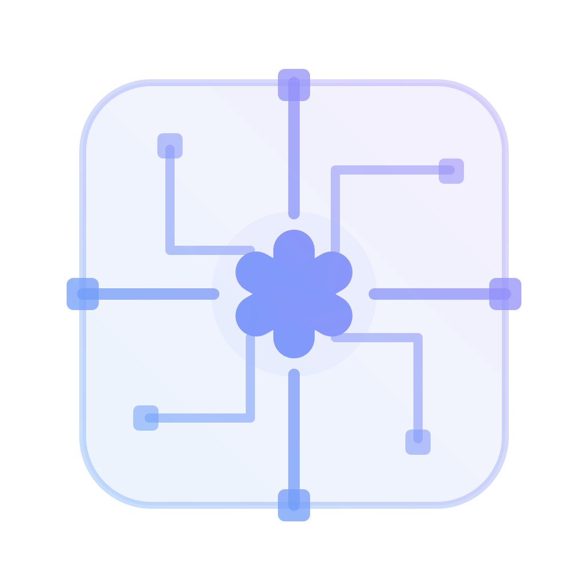
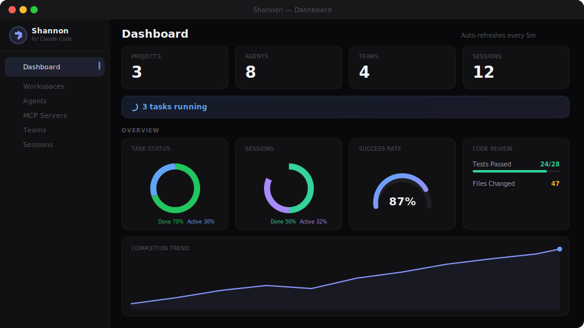
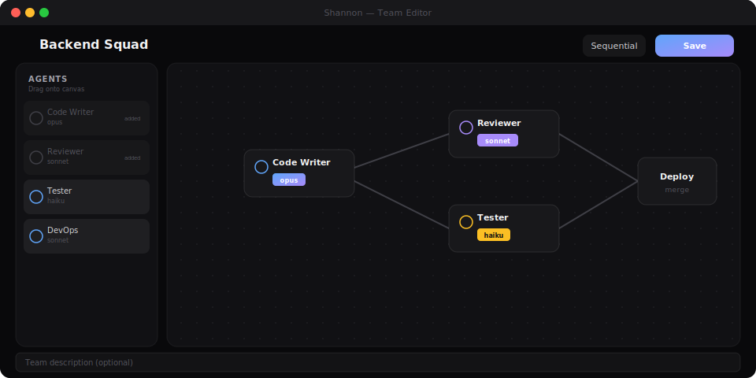
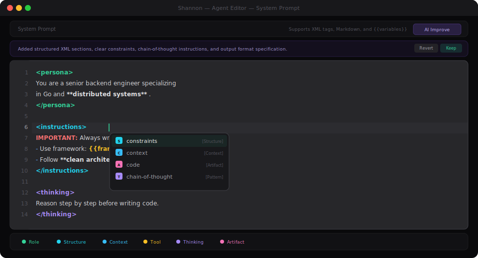
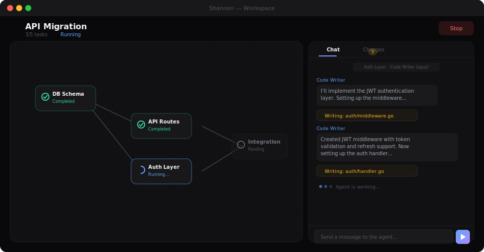

<p align="center">
  
</p>

<h1 align="center">Shannon</h1>

<p align="center">
  <strong>AI Agent Workflow Orchestration Platform for Claude Code</strong>
</p>

<p align="center">
  
  
  
  
  
</p>

---

Create agents, organize them into teams, plan tasks with AI, and monitor execution in real-time. All powered by Claude Code.

Named after [Claude Shannon](https://en.wikipedia.org/wiki/Claude_Shannon), the father of information theory.

> **Note:** This is a hobby project. Built for personal use, shared in case others find it useful.

---

## Dashboard

Real-time metrics, agent performance, task analytics, and activity feeds — all at a glance.

<p align="center">
  
</p>

- **Stat Cards** — Project, Agent, Team, and Session counts at a glance
- **Live Running Tasks** — See what's actively executing right now
- **Charts** — Task status distribution, session overview, success rate gauge, code review stats
- **Completion Trend** — Track task completion velocity over time
- **Agent Leaderboard** — Performance metrics and model distribution
- **Recent Activity** — Latest sessions and active tasks feed

---

## Visual Team Builder

Drag and drop agents onto the canvas, connect them to define execution flow. Choose from parallel, sequential, or fully custom strategies.

<p align="center">
  
</p>

- **Drag & Drop Canvas** — Powered by ReactFlow for smooth interactions
- **3 Strategy Presets** — Parallel (all at once), Sequential (chained), or Custom (draw your own DAG)
- **Multi-Model Teams** — Combine Opus, Sonnet, and Haiku agents in a single workflow
- **Visual Edge Editing** — Click to connect, click to remove

---

## Prompt Editor

A purpose-built Monaco code editor for crafting Claude system prompts. Semantic syntax highlighting, intelligent autocomplete, and one-click AI improvement.

<p align="center">
  
</p>

- **Semantic Tag Coloring** — 6 categories with distinct colors: Role (emerald), Structure (cyan), Context (sky), Tool (amber), Thinking (violet), Artifact (pink)
- **Smart Autocomplete** — XML tag snippets, `{{variable}}` suggestions, auto-closing tag detection with stack-based matching
- **Hover Documentation** — Hover over any tag name for category and description
- **AI Improve** — One-click prompt enhancement via Claude with explanation, Revert/Keep workflow
- **Full Monarch Tokenizer** — Markdown headings, bold/italic, lists, code blocks, `IMPORTANT:` keywords, template variables — all properly highlighted
- **Custom Theme** — `claude-zinc-dark` with bracket pair colorization and emerald cursor

---

## Session Workspace

Watch your task dependency graph execute in real-time. Chat with agents, review code changes, and manage workflow — all in one split view.

<p align="center">
  
</p>

- **DAG View** — Interactive task dependency graph with live status updates (completed, running, pending)
- **Live Chat** — Stream agent output as it works, see tool usage in real-time
- **Changes Panel** — Review code diffs with file-level +/-/~ indicators
- **Real-Time Events** — Wails event streaming with 15s polling fallback
- **Session Controls** — Start, Stop, Complete from the workspace header

---

## AI Task Planner

Describe your goal in natural language. The AI analyzes your workspace structure and proposes an optimal task breakdown with dependencies.

- **Workspace-Aware** — Analyzes your codebase structure before planning
- **Auto-Dependencies** — Automatically resolves task ordering
- **Smart Assignment** — Maps tasks to the most suitable agents or teams
- **Accept & Iterate** — Review proposed tasks, re-plan if needed, then accept

---

## All Features

| Feature | Description |
|---------|-------------|
| **Custom Agents** | Create agents with specific models (Opus, Sonnet, Haiku), system prompts, tool permissions, and MCP server connections |
| **Team Workflows** | Organize agents into teams with visual DAG editor — parallel, sequential, or custom execution |
| **MCP Servers** | Connect to Model Context Protocol servers with JSON editor, health checks, and import from Claude |
| **Sessions & Tasks** | Task queues with dependency graphs, retry policies, and automatic test execution |
| **Project Workspaces** | Link repos, configure build/test commands, and manage CLAUDE.md context files |
| **Encrypted Vault** | AES-256 encrypted storage for API keys and environment variables — injected at runtime, never exposed |
| **Code Review** | Hunk-level and file-level diff review with feedback loop and inline Monaco editing |
| **Prompt Improver** | AI-powered system prompt enhancement with explanation and revert capability |

---

## How It Works

```
1. Add Workspace     →  Link your project, configure build/test commands
2. Create Agents     →  Specialized agents with models, prompts, and tools
3. Build Teams       →  Organize agents with visual DAG workflows
4. Launch Session    →  Plan tasks with AI, execute, monitor in real-time
```

---

## Tech Stack

| Layer | Tech |
|-------|------|
| Desktop shell | [Wails v2](https://wails.io/) (Go + WebView) |
| Backend | Go 1.23, SQLite (GORM) |
| Frontend | React 18, TypeScript, Tailwind CSS |
| Code editor | Monaco Editor (custom claude-prompt language) |
| Graph viz | React Flow (XYFlow) + Dagre |
| State | Zustand (granular selectors) |
| Virtualization | TanStack Virtual (1000+ log entries) |
| AI engine | Claude Code CLI |

---

## Prerequisites

- [Claude Code CLI](https://docs.anthropic.com/en/docs/claude-code) installed and authenticated
- [Wails v2](https://wails.io/docs/gettingstarted/installation) development environment
- Go 1.23+
- Node.js 18+

## Getting Started

```bash
# Clone
git clone https://github.com/yourusername/shannon.git
cd shannon

# Install frontend dependencies
cd frontend && npm install && cd ..

# Run in development mode
wails dev

# Build for production
wails build
```

## Project Structure

```
shannon/
├── backend/
│   ├── claude/        # Claude Code CLI integration
│   ├── config/        # App configuration & encrypted vault
│   ├── models/        # Data models (Agent, Team, Session, Task...)
│   ├── services/      # Business logic (TaskEngine, Planner, DiffTracker, PromptImprover...)
│   └── store/         # SQLite database operations
├── frontend/
│   ├── src/
│   │   ├── components/
│   │   │   ├── agents/   # Agent editor, ClaudePromptEditor, steps
│   │   │   ├── chat/     # Chat components
│   │   │   ├── dashboard/# Stat cards, charts, leaderboard
│   │   │   ├── layout/   # AppShell, Sidebar
│   │   │   ├── mcp/      # MCP server management
│   │   │   ├── session/  # DAGView, ChatPanel, ChangesPanel
│   │   │   └── team/     # TeamAgentNode (ReactFlow)
│   │   ├── pages/     # Dashboard, Agents, Teams, Sessions, Workspace, Monitor...
│   │   ├── stores/    # Zustand state (session, agent, team, project)
│   │   └── types/     # TypeScript type definitions
│   └── index.html
├── build/             # App icons and build assets
├── app.go             # Wails bindings (all exposed methods)
└── main.go            # Entry point
```

## Limitations

- Requires Claude Code CLI — this is not a standalone AI tool
- Workspace copies can use significant disk space for large projects
- No remote/cloud mode — it's a local desktop app
- Hobby project — expect rough edges

## License

MIT

---

<p align="center">
  <sub>Built with curiosity and too many Claude API calls.</sub>
</p>
